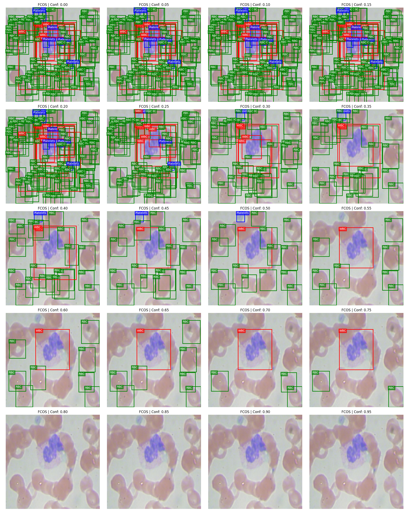
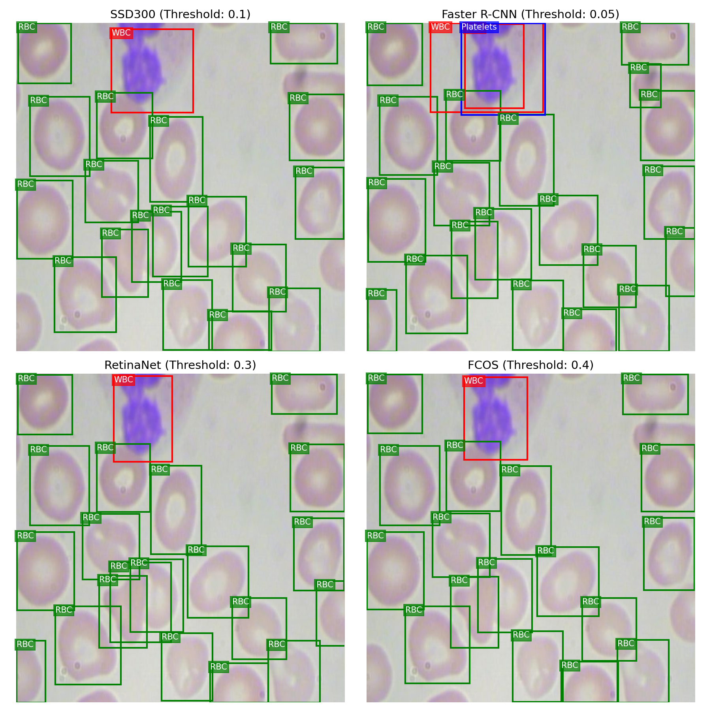

# Детекция клеток крови на микроснимках мазков крови методами Computer Vision

Репозиторий содержит проект, посвященный задаче детекции и классификации клеток крови
(лейкоцитов, эритроцитов и тромбоцитов) на микроснимках мазков крови с использованием 
методов Computer Vision. В проекте реализовано сравнительное исследование четырех 
моделей детекции объектов.

Основная цель проекта — оценить, насколько различные модели детекции объектов способны 
детектировать клетки в условиях медицинских данных, где разметка далека от идеальной и 
содержит значительное количество пропущенных объектов.

### Мотивация к реализации

Изначально данный проект был реализован в качестве домашней работы по обучению моделей 
детекции. Однако мне понравилась поставленная задача и моя реализация, поэтому мной было 
принято решение расширить данный проект, добавив сравнение нескольких моделей и расчет 
метрик.

### Актуальность проекта

Несмотря на существование автоматизированных гематологических анализаторов, анализ мазков
крови по-прежнему остается рутинной задачей лабораторной диагностики, подверженной 
человеческому фактору. Детекция клеток на изображениях при помощи нейросетей может 
использоваться как инструмент предварительного анализа, позволяющий ускорить и 
удешевить подсчет клеток и снизить объем ручной работы специалиста.

---

##  Стек технологий

* **Язык**: Python 3.10+
* **Глубокое обучение**: PyTorch, Torchvision
* **Аугментация данных**: Albumentations
* **Валидация и метрики**: Torchmetrics (MeanAveragePrecision)
* **Инструменты и анализ**: OpenCV, Pandas, NumPy, Matplotlib, XML.etree.ElementTree

---

## Структура репозитория

```text
├── src/                            # Исходный код проекта (Модули)
│   ├── dataset.py                  # Загрузка данных, XML-парсер, Albumentations-трансформации, сборка DataLoader
│   ├── models.py                   # Инициализации моделей (SSD, FasterRCNN, RetinaNet, FCOS)
│   ├── engine.py                   # Функции для обучения моделй и подсчета метрик mAP
│   └── visualization.py            # Функции отрисовки изображений с ограничивающими рамками, коллажей и сеток инференса
├── reports/                        # Отчеты
│   ├── figures/                    # Сгенерированные графики, коллажи и результаты детекции
│   │   ├── comparison_of_models    # Коллажи сравнения предсказаний моделей
│   │   ├── initial_segmentation    # Коллажи изображений с исходной разметкой
│   │   └── models_thresholds       # Коллажи предсказаний моделей с разными порогами уверенности
│   ├── test_metrics.csv            # Сводная таблица метрик в формате CSV
│   └── test_metrics.md             # Сводная таблица метрик в формате Markdown
├── .gitignore                      # Исключение тяжелых весов и датасета из контроля версий
├── data_preparation.py             # Скрипт для загрузки и визуализации изображений с ограничивающими рамками
├── train.py                        # Скрипт для обучения всех моделей с сохранением лучших весов
├── evaluate.py                     # Скрипт для валидации сохраненных весов на тестовых данных
├── LICENSE-DATA.txt                # Текстовый документ с информацией о лицензии на данные
├── requirements.txt                # Список зависимостей для развертывания проекта
└── README.md                       # Документация проекта
```

---
## Источник данных и лицензия

В работе используется датасет BCCD, содержащий изображения мазков крови с аннотациями.
Классы объектов на изображениях:
* WBC — лейкоциты;
* RBC — эритроциты;
* Platelets — тромбоциты.

Датасет распространяется под лицензией **MIT License**. 

* **Оригинальный репозиторий датасета**: [BCCD_Dataset](https://github.com/Shenggan/BCCD_Dataset)
* **Условия использования**: Разрешается копирование, изменение и распространение данных 
при условии указания авторства оригинального разработчика. Соответствующий файл лицензии 
сохранен в корне проекта.

## Использованное оборудование

* GPU: NVIDIA GeForce RTX 4050
* RAM: 16 GB
* Память: 5 GB (с учетом установки библиотек)

##  Установка и запуск

1. Клонируйте репозиторий:
   ```bash
   git clone https://github.com/vladschwartz99-cmd/portfolio.git
   ```
   
2. Перейдите в директорию проекта:
   ```bash
   cd portfolio/Blood_cells_detection
   ```
   
3. Установите зависимости:
   ```bash
   pip install -r requirements.txt
   ```
   
4. Скачайте датасет (размещенный в публичном доступе на Kaggle):
   ```bash
   pip install kaggle
   kaggle datasets download -d konstantinazov/bccd-dataset
   ```

5. Разархивируйте данные в корне проекта:
   ```bash
   python -c "import zipfile; zipfile.ZipFile('bccd-dataset.zip').extractall('BCCD_dataset')"
   ```

7. Запустите проект:
   ```bash
   python data_preparation.py
   python train.py    # (модели тренируются ~ 5 часов на RTX 4050)
   python evaluate.py 
   ```

## Исследовательский анализ данных (EDA)

Визуальный анализ случайных подвыборок снимков показал, что датасет обладает рядом 
особенностей:

1. **Неполнота разметки:** В то время как практически все лейкоциты размечены,
разметка значительной часть эритроцитов и тромбоцитов отсутствует. Это может приводить к
тому, что модель будет штрафоваться за верно размеченные клетки.

2. **Дисбаланс классов и плотность объектов:** 
   * Лейкоциты: Обычно представлены по одному на изображение и имеют крупные размеры.
   * Эритроциты: Встречаются в большом количестве и часто наслаиваются друг на друга.
   * Тромбоциты: Обладают небольшим размером, представлены в малом количестве и 
   не на всех изображениях. 
   
   Из-за этого задача сочетает в себе проблемы сильного дисбаланса классов, 
высокой плотности объектов и детекции мелких структур.

Коллаж изображений с исходной разметкой:

<p align="center">
  
</p>

---

## Исследуемые архитектуры моделей

Были выбраны четыре популярные архитектуры детекции объектов для определения наиболее 
эффективной для данной задачи:

1. **SSD300**: Одностадийный детектор на базе VGG16. Использовался как базовая модель.
2. **Faster R-CNN**: Классический двухстадийный детектор на базе ResNet50 FPN v2. 
Ожидалось, что данная архитектура обеспечит наиболее точную локализацию объектов.
3. **RetinaNet**: Одностадийный детектор, разработанный для борьбы с дисбалансом между 
фоном и объектами за счет чего ожидалась высокая точность детекции.
4. **FCOS**: Безанкорный детектор. Отсутствие необходимости в исходной разметке для 
обучения теоретически должно снизить чувствительность к недостаткам разметки.

---

## Метрики

Все модели были обучены в течение 50 эпох(с использованием оптимизатора SGD и 
планировщика ReduceLROnPlateau по метрике mAP@75)

Сводная таблица метрик качества (`MeanAveragePrecision`):


| Метрика\Модель                 | SSD300 |Faster R-CNN  | RetinaNet |   FCOS    |
|:-------------------------------|:------:|:------------:|:---------:|:---------:|
| **mAP**                        | 0.245  |    0.491     |   0.210   | **0.512** |
| **mAP@50**                     | 0.410  |    0.725     |   0.380   | **0.754** |
| **mAP@75**                     | 0.180  |  **0.665**   |   0.155   |   0.663   |
| **mAP WBC (Лейкоциты)**        | 0.620  |    0.761     |   0.590   | **0.766** |
| **mAP RBC (Эритроциты)**       | 0.310  |    0.574     |   0.240   | **0.614** |
| **mAP Platelets (Тромбоциты)** | 0.110  |  **0.456**   |   0.090   |   0.445   |


---

## Визуальный анализ

Был проведен визуальный анализ работы всех моделей с шагом порога уверенности 0.05 для
подбора оптимальных порогов уверенности для каждой модели.

Пример предсказаний модели с разными порогами уверенности:

<p align="center">
  
</p>

После этого был проведен визуальный анализ работы всех моделей с подобранными порогами.

Итоговое визуальное сравнение всех моделей с подобранными порогами:

<p align="center">
  
</p>

---

### Анализ результатов:

1. Лучшие результаты продемонстрировали модели Faster R-CNN и FCOS. Faster R-CNN 
показывает наивысшие метрики mAP 75 и mAP для тромбоцитов, опережая FCOS на 0.2% и 1.1% 
соответственно. По метрикам mAP для лейкоцитов и эритроцитов модель FCOS опережает 
модель Faster R-CNN на 0.5% и 4%. Также модель FCOS в меньшей степени генерирует ложные 
дублирующиеся рамки.
   
2. Модель RetinaNet показала самые низкие результаты среди всех моделей. Вероятно, 
из-за неполноты исходной разметки, анкорные модели (все, кроме FCOS) получали ложные 
штрафы при генерации рамок действительно существующих, но пропущенных в исходной 
разметке, клеток. FCOS оказался более устойчив к неполноте разметки, что, вероятнее 
всего, и является основным фактором, почему FCOS показывает лучшие метрики на данном 
датасете.

3. Все модели показали низкий mAP на тромбоцитах. Это, вероятно, связано с их 
небольшим размером на снимках и малым количеством примеров в обучающей выборке.
